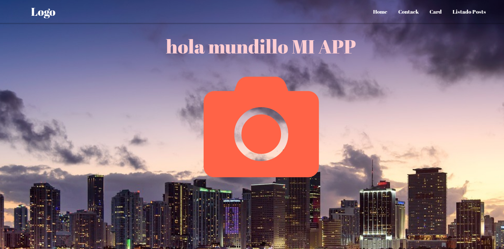

# nodejs-basico-sequelieze-api-web con materialize

;
;
;

NODEJS - BASICO CON SEQUELIZE -API/WEB BASICO-  CON MATERIALIZE -IMAGEN DE FONDO 
TODO INTEGRADO EN UN INDEX.JS.

SE HA UTILIZADO:
Diseños web: MATERIALIZE : https://materializecss.com 
Las animaciones con:  https://github.com/daneden/animate.css
Los iconos con:  https://fontawesome.com
Las fuentes con: https://fonts.google.com/

Y el degradado con: https://cssgradient.io/

